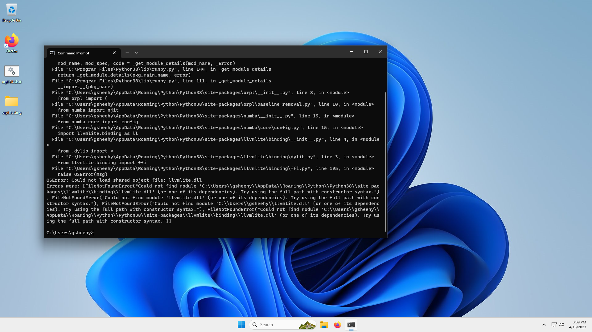
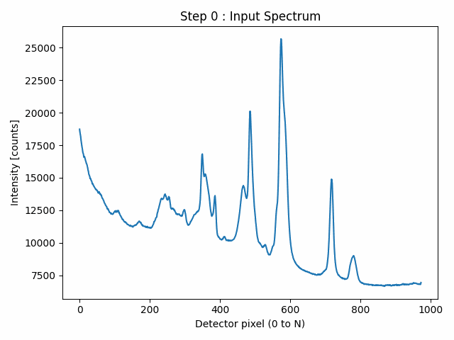

# ORPL

ORPL (read _orpel_) is the Open Raman Processing Library. It provides tools for the processing of Raman spectrum, including;

1. System calibration (x-axis and system response)
2. Cosmic Ray removal
3. Baseline removal (autofluorescence)
4. Spectrum analysis (peak finding, ...)
5. Synthetic spectrum generation (for testing and benchmarking)

As of v1.0.0, ORPL also provides a Graphical User Interface. See demo below ;)

## Table of content

- [ORPL](#orpl)
  - [Table of content](#table-of-content)
  - [ORPL GUI in action](#orpl-gui-in-action)
  - [Windows requirements](#windows-requirements)
    - [LLVMLITE Error](#llvmlite-error)
  - [Installation](#installation)
    - [Already familiar with python and pip?](#already-familiar-with-python-and-pip)
    - [I'm new to python and this 'pip' thing?](#im-new-to-python-and-this-pip-thing)
      - [Content of the `orpl GUI.txt` file](#content-of-the-orpl-guitxt-file)
    - [Updating ORPL to the latest version](#updating-orpl-to-the-latest-version)
      - [If you have admin rights](#if-you-have-admin-rights)
      - [If you do not have admin rights](#if-you-do-not-have-admin-rights)
    - [Building from source](#building-from-source)
  - [Baseline removal](#baseline-removal)
    - [BubbleFill](#bubblefill)
  - [How to cite this work](#how-to-cite-this-work)
    - [BibTex (.bib)](#bibtex-bib)
    - [EndNote (.enw)](#endnote-enw)
    - [Contributors](#contributors)

## ORPL GUI in action

https://user-images.githubusercontent.com/27356351/225768644-56ebf40a-51d1-44a1-bba3-edb86f8b1fad.mp4

## Windows requirements

If you are using windows, you need to have a version of the Microsoft Visual C+ Redistributable packages. You can find details about this and the installation file at

https://learn.microsoft.com/en-US/cpp/windows/latest-supported-vc-redist?view=msvc-170

Otherwise here are the download links from that page (they are not obvious so I linked them here):

| Architecture                                         | Link                                             | Notes                                                                                                                                                                                                                                                    |
| ---------------------------------------------------- | ------------------------------------------------ | -------------------------------------------------------------------------------------------------------------------------------------------------------------------------------------------------------------------------------------------------------- |
| ARM64                                                | https://aka.ms/vs/17/release/vc_redist.arm64.exe | Permalink for latest supported ARM64 version                                                                                                                                                                                                             |
| X86 (Windows 32 bits)                                | https://aka.ms/vs/17/release/vc_redist.x86.exe   | Permalink for latest supported x86 version                                                                                                                                                                                                               |
| X64 (Windows 64 bits, **most likely what you need**) | https://aka.ms/vs/17/release/vc_redist.x64.exe   | Permalink for latest supported x64 version. The X64 Redistributable package contains both ARM64 and X64 binaries. This package makes it easy to install required Visual C++ ARM64 binaries when the X64 Redistributable is installed on an ARM64 device. |

### LLVMLITE Error

If you try to run ORPL on windows without this dependency, you will get an OSError that looks like this



## Installation

At its core, ORPL is designed to be a processing library to use in your own processing workflow. Nevertheless, I also wrote a GUI to go with it if programming is not your jam. In either case, installation is made through **pip**.

### Already familiar with python and pip?

I recommend you create a virtual environment with [**venv**](https://docs.python.org/3/library/venv.html). Otherwise, just install **orplib** with pip.

```
pip install orplib
```

Using Anaconda?... dont... Jokes aside, if people ask me about this, I might write a guide for this. Otherwise, use pip.

### I'm new to python and this 'pip' thing?

First, if you are using windows, please make sure you installed the _Microsoft Visual C++ Redistributable_ as mentioned in the [Windows requirements](#windows-requirements) section. You can install it after python if you want, so it's no problem if you forget ;)

I made a video going through everything on a clean **Windows 11** [VM](https://en.wikipedia.org/wiki/Virtual_machine), the same steps should work as well for **Windows 10**. Here is the video so you can follow step-by-step. PLEASE, make certain you follow the steps EXACTLY for the python installation. Otherwise, you'll get a bunch of error in your terminal and might get lost.

https://user-images.githubusercontent.com/27356351/225757919-e89d59c2-ff3f-4555-bffc-16b11ef3ecde.mp4

The steps for **Windows** are:

1. Check if python is already installed
   1. Open a terminal
   2. run `python`
      - If you get something like `Python 3.X.X (tag)... Type "help", "copyright", ...`, then you already have a python version installed. Check if it is compatible with ORPL. If so, move to Step 2.7
      - If a Microsoft Store window opens, or you get a message along the line of `... is not recognized as an internal or external command...`, then python is not installed. Proceed with Step 2.1
2. Install python (I test with [python 3.8.10](https://www.python.org/downloads/release/python-3810/), but other versions might work perfectly fine)
   1. **DO NOT!!!** use "Install Now" or default setting, it almost certainly won't work, and you'll have to start over again.
   2. Make sure you check all boxes on the first page.
   3. Use "Customize installation".
   4. Make sure you check EVERYTHING, I mean ALL checkboxes as you keep going through the pages.
   5. Once the installation is finished, you'll see a last page with "Setup was successful" if it worked. You might see a `Disable path length limit...` option. If so, click it and accept.
   6. Check if **Python** was correctly installed by running `python` in a terminal (see Step 2.2)
   7. Check if **pip** was installed and added to your Path by running `pip` in a new terminal.
      - If you see a long stream of text starting with `Usage: pip <command> [options]`, then you are good!
      - Otherwise, something went wrong...
3. Install orplib (https://pypi.org/project/orplib/) with pip
   1. Run pip command for installation:
      - If your user has admin rights, run `pip install orplib` in terminal
      - Otherwise, run `pip install orplib --user` in terminal
   2. Check that ORPL installed correctly by running `python -m orpl` in terminal.
      - If you get an error message, something went wrong...
      - Otherwise, it will take a few seconds the first time you launch it. Please, be patient.
4. (optional) create a script file to launch ORPL - GUI
   1. Create a new text file on the Desktop (I suggest calling it `orpl GUI.txt`)
   2. Open the text file with notepad
   3. Write the content below inside that file
   4. Save the file and close it
   5. Change the extension name of the file to `.bat`

##### Content of the `orpl GUI.txt` file

```
python -m orpl
pause
```

### Updating ORPL to the latest version

If you want to update to the latest version of ORPL, run the following pip command,

#### If you have admin rights

```
pip install --upgrade orplib
```

#### If you do not have admin rights

```
pip install --upgrade --user orplib
```

### Building from source

This is the command you need to run if you want to build the .whl from the source code yourself (make sure you run it from orpl's project root directory):

```
python -m build
```

and to update the build on pypi (this is a reminder for me, it won't do anything if you do this),

```
python -m twine upload --repository pypi --skip-existing dist/*
```

## Baseline removal

### BubbleFill

Bubblefill is a morphological processing algorithm designed for the removal of baselines in spectroscopic signal. It was created and optimized specifically to remove autofluorescence baselines in Raman spectra measured on biological samples.



The tuning parameter of Bubblefill is the size of the smallest bubble allowed to grow. In general, the smallest bubble width should be chosen to be larger than the widest Raman peak present in the signal. Otherwise, the baseline fit will _grow_ inside the peaks and the output Raman signal will have under expressed peaks.

**Note** : Bubbles can become arbitrarily small if they are growing along the leftmost or rightmost edge of the signal.


Different smallest bubble widths can be specified for different regions of the spectrum. This enables nearly infinite tuning of the algorithm and can be used to remove peaks that are known artifacts (for instance). In this example, the smallest bubble width for detector pixels 400 to 650 was set to 1 and to 100 for the rest of the x-axis.


## How to cite this work

Guillaume Sheehy, Fabien Picot, Frédérick Dallaire, Katherine Ember, Tien Nguyen, Kevin Petrecca, Dominique Trudel, and Frédéric Leblond "Open-sourced Raman spectroscopy data processing package implementing a baseline removal algorithm validated from multiple datasets acquired in human tissue and biofluids," Journal of Biomedical Optics 28(2), 025002 (21 February 2023). https://doi.org/10.1117/1.JBO.28.2.025002

### BibTex (.bib)

```
@article{10.1117/1.JBO.28.2.025002,
author = {Guillaume Sheehy and Fabien Picot and Fr{\'e}d{\'e}rick Dallaire and Katherine Ember and Tien Nguyen and Kevin Petrecca and Dominique Trudel and Fr{\'e}d{\'e}ric Leblond},
title = {{Open-sourced Raman spectroscopy data processing package implementing a baseline removal algorithm validated from multiple datasets acquired in human tissue and biofluids}},
volume = {28},
journal = {Journal of Biomedical Optics},
number = {2},
publisher = {SPIE},
pages = {025002},
keywords = {Raman spectroscopy, fluorescence, tissue optics, open-sourced software, machine learning, optics, Raman spectroscopy, Data processing, Bubbles, Equipment, Tissues, Biological samples, Raman scattering, Fluorescence, Aluminum, Spectroscopy},
year = {2023},
doi = {10.1117/1.JBO.28.2.025002},
URL = {https://doi.org/10.1117/1.JBO.28.2.025002}
}
```

### EndNote (.enw)

```
%0 Journal Article
%A Sheehy, Guillaume
%A Picot, Fabien
%A Dallaire, Frédérick
%A Ember, Katherine
%A Nguyen, Tien
%A Petrecca, Kevin
%A Trudel, Dominique
%A Leblond, Frédéric
%T Open-sourced Raman spectroscopy data processing package implementing a baseline removal algorithm validated from multiple datasets acquired in human tissue and biofluids
%V 28
%J Journal of Biomedical Optics
%N 2
%P 025002
%D 2023
%U https://doi.org/10.1117/1.JBO.28.2.025002
%DOI 10.1117/1.JBO.28.2.025002
%I SPIE
```

### Contributors

- **Guillaume Sheehy** | guillaume.sheehy@polymtl.ca
- **Frédérick Dallaire**
- **Fabien Picot**
