# Installing ORPL - Windows

- [Installing ORPL - Windows](#installing-orpl---windows)
  - [Installing dependencies](#installing-dependencies)
    - [Installing Microsoft Visual C++ Redistributable](#installing-microsoft-visual-c-redistributable)
  - [Installing python](#installing-python)
    - [Setting up the table (optional)](#setting-up-the-table-optional)
      - [Showing `file name extensions`](#showing-file-name-extensions)
      - [Setting up the Terminal](#setting-up-the-terminal)
    - [Downloading a python installer](#downloading-a-python-installer)
    - [Running the installer](#running-the-installer)
  - [Validating that the installation was a success](#validating-that-the-installation-was-a-success)
  - [Installing ORPL](#installing-orpl)
  - [Creating a Desktop shortcut to launch ORPL GUI](#creating-a-desktop-shortcut-to-launch-orpl-gui)

## Installing dependencies

### Installing Microsoft Visual C++ Redistributable

1. Go to [https://learn.microsoft.com/en-US/cpp/windows/latest-supported-vc-redist?view=msvc-170](https://learn.microsoft.com/en-US/cpp/windows/latest-supported-vc-redist?view=msvc-170)
2. Download the correct version for your system (most likely X64 architecture), or download it from the ([https://aka.ms/vs/17/release/vc_redist.x64.exe](https://aka.ms/vs/17/release/vc_redist.x64.exe))
3. Run the installer
4. Close once it's successful

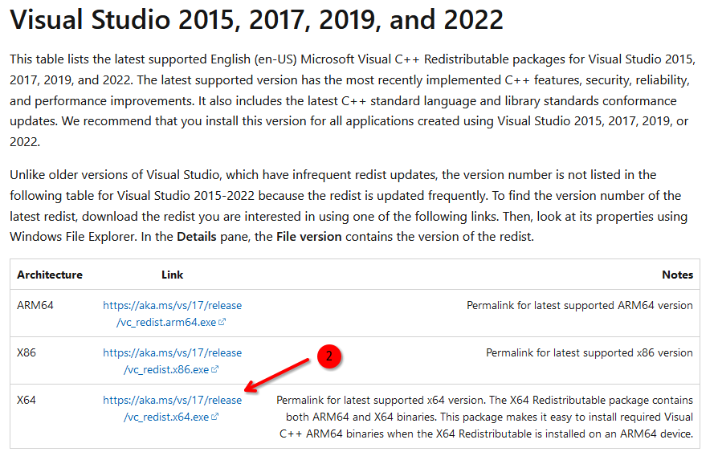

## Installing python

### Setting up the table (optional)

Before you go through with installing python, there are a few things that I recommend you do with your system. All of this is optional, of course, so feel free to skip this section.

#### Showing `file name extensions`

Most files have an extension name, and it is usually very helpful to know what it is at a glance. To enable this feature,

1. Open `File Explorer`
2. Click on the `View` menu
3. Go to `Show`
4. Check `File name extensions`

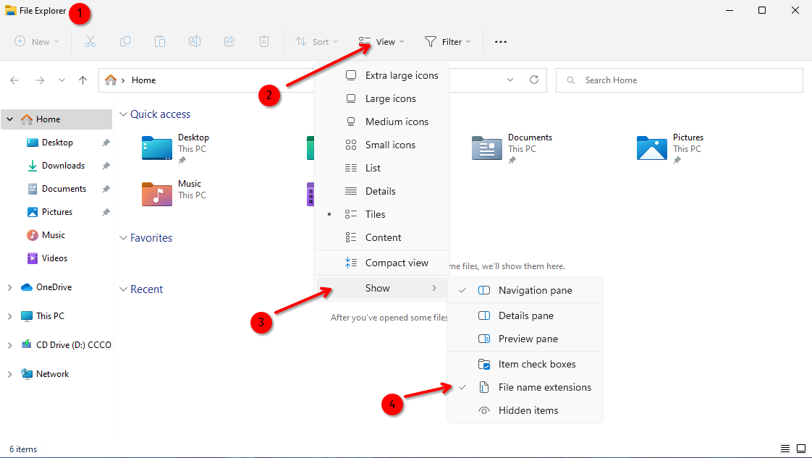

On Windows 10:

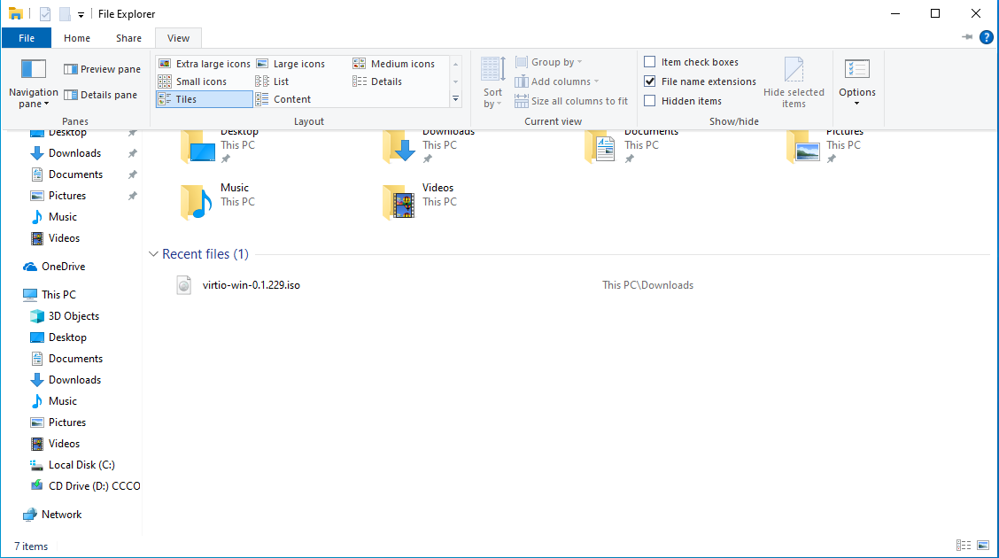

#### Setting up the Terminal

The Terminal is an incredibly powerful tool, even though a bit scary at first (trust me, I get it). After decades of abandon, Microsoft massively improved its features in Windows 11. To make it even more accessible and useful, I like to pin it to the taskbar and to change the default profile to `Command Prompt`.

1. Pin it to the taskbar
   1. Click the `start menu`
   2. Search for `Terminal`
   3. Right click `Terminal` (on Windows 10, this is `Command Prompt`)
   4. Click `Pin to taskbar`
2. Change the default profile to `Command Prompt` **(Windows 11 only)**
   1. Launch `Terminal`
   2. Click the down menu arrow
   3. Open the `Settings` menu
   4. Change the `Default profile` to `Command Prompt`

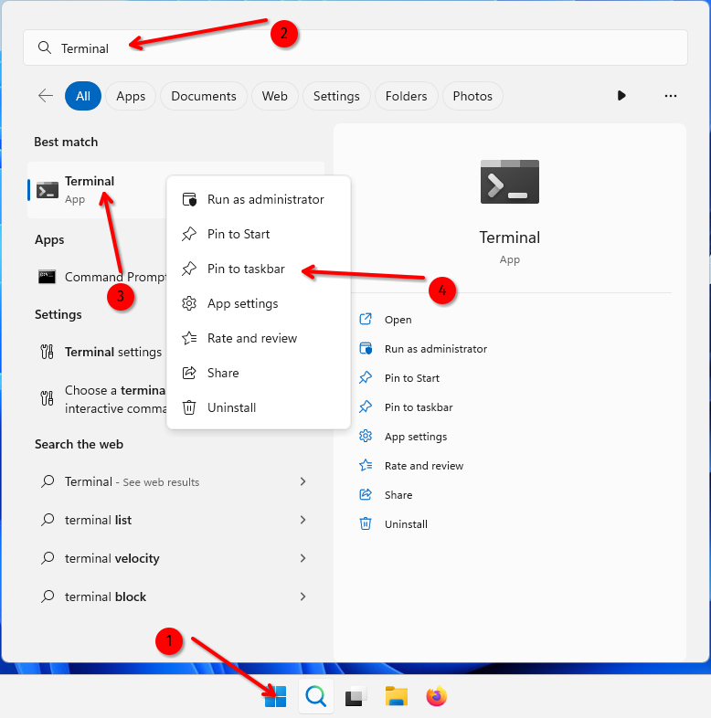

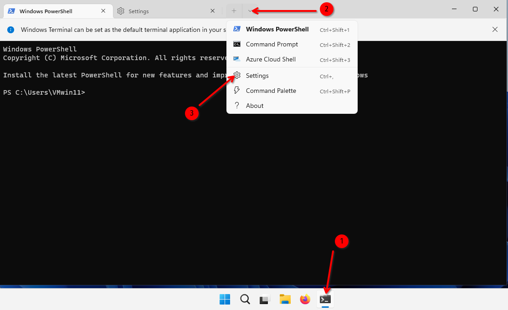

### Downloading a python installer

Here is a download link for the windows 64-bit installer for python 3.10.11 : [https://www.python.org/ftp/python/3.10.11/python-3.10.11-amd64.exe](https://www.python.org/ftp/python/3.10.11/python-3.10.11-amd64.exe).

Otherwise,

1. Go to [https://www.python.org/](https://www.python.org/)
2. Go to the downloads section for windows (or [https://www.python.org/downloads/windows/](https://www.python.org/downloads/windows/))
3. Find a version of python that has a `Download Windows installer (64-bit)` link (32-bit might be the one you need if you are running a 32-bit system, otherwise pick 64-bit)
4. As of April 2023, I recommend using the latest revision of python 3.10.

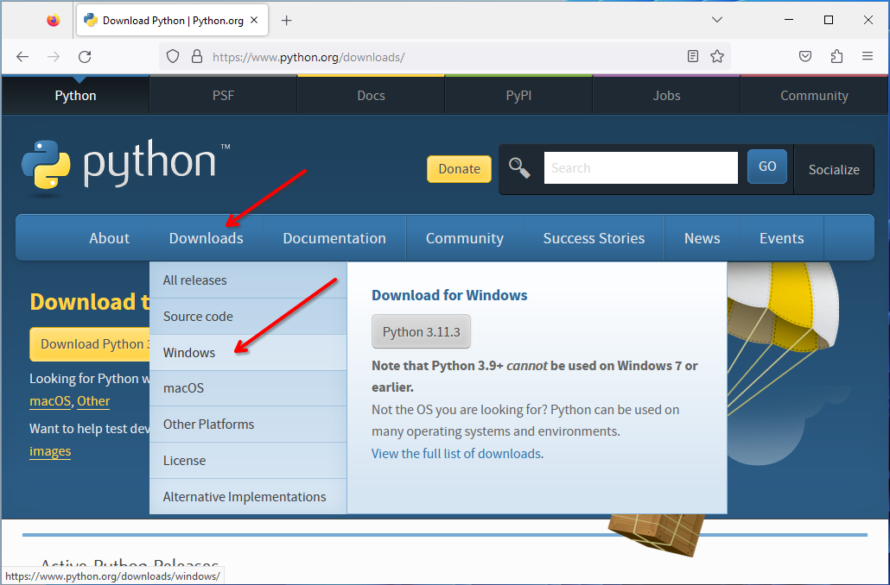

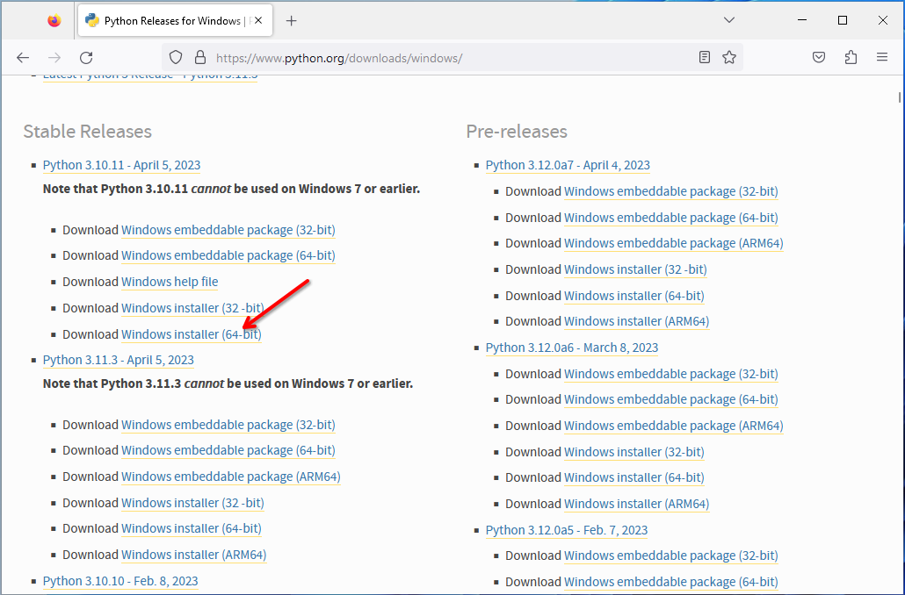

### Running the installer

1. Run the installer you downloaded (in this example, its name is `python-3.10.11-amd64.exe`)
2. Follow the screenshots **CAREFULLY** (selecting different options might lead to problems and you'll have to uninstall everything and start over)
3. On the first page:
   1. Check `Use admin privileges when installing py.exe`
   2. Check `Add python.exe to PATH`
   3. Click `Customize installation`
4. On the second page:
   1. Check EVERYTHING
5. On the third page:
   1. Check EVERYTHING
   2. Make sure the `Customize install location` is `C:\Program Files\PythonXX`, no somewhere in `C:\Users\...\AppData\Local\...`
   3. Click `Install`
6. After the installation:
   1. You should see that `Setup was successful`
   2. Click the button to `Disable path length limit` if you see it. If not, it means the path length limit has already been disabled on your system.
   3. Close the installer.
7. Verify that python was installed by running `python` in your terminal
   1. If so, you will see

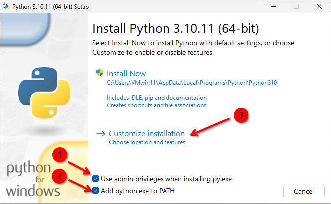

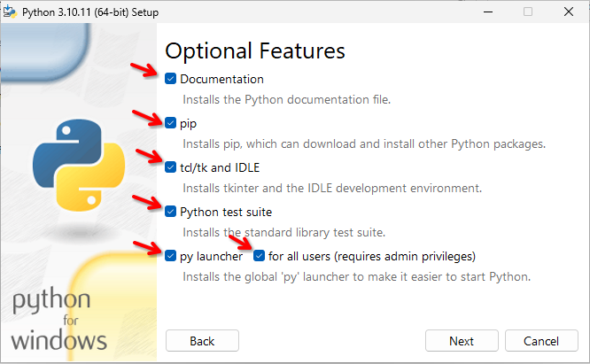

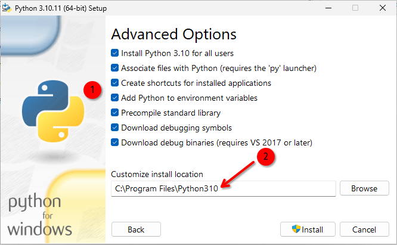

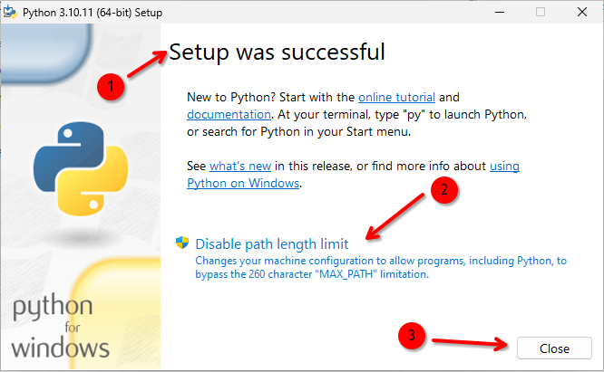

## Validating that the installation was a success

Now that we went through the installation, we verify that `python` and `pip` were installed by

1. Opening Terminal
2. Running `python`
3. Python is **installed** if you get a prompt that looks like:
   - `Python 3.10.11 ... Type "help", "copyright", ...`
4. Exit python by running `exit()` (or opening a new terminal)
5. Running `pip`
6. Pip is installed if you get the help text that starts with `Usage: pip <command> [options] ...`

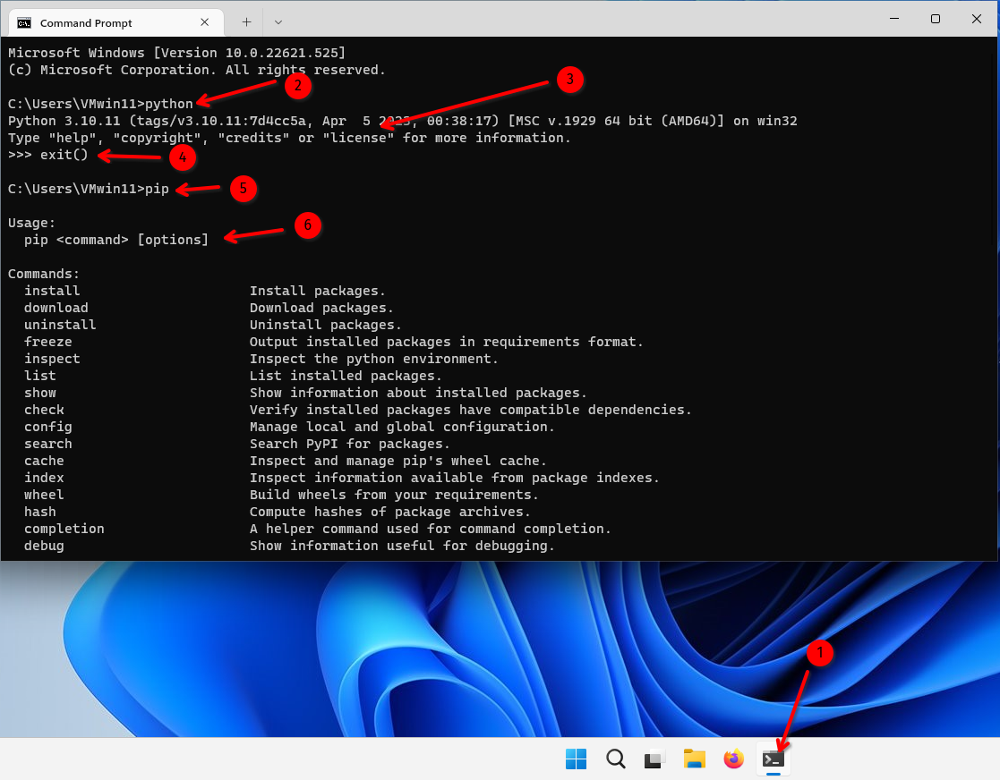

## Installing ORPL

1. Open terminal
2. Run `pip install orplib`
3. Test that it works by running `python -m orpl`
4. If the GUI launches, everything works
   - This can take a while for the first launch
   - If no errors, it's doing stuff, please be patient.

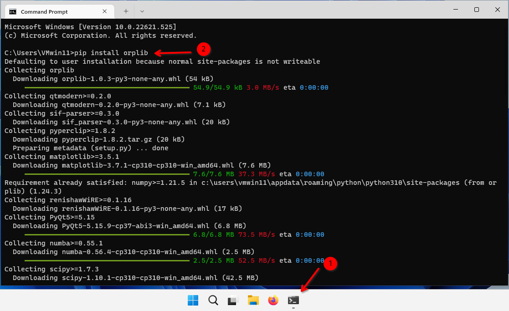

## Creating a Desktop shortcut to launch ORPL GUI

Before you do this, make sure you have gone through [**Setting up the table (optional)**](<#Setting%20up%20the%20table%20(optional)>). Otherwise you won't be able to rename the `.txt` file to a `.bat` file.

1. Right-click on your Desktop
2. Create a new `Text Document`
3. Name it `ORPL - GUI.txt` (or whatever you prefer)
4. Open it with notepad
5. Write in the following lines
   - `python -m orpl`
   - `pause`
6. Save and close the text file
7. Rename the text file to a `.bat` extension (`ORPL - GUI.bat`)

You can now double-click the `ORPL - GUI.bat` file as a shortcut to launch ORPL GUI.

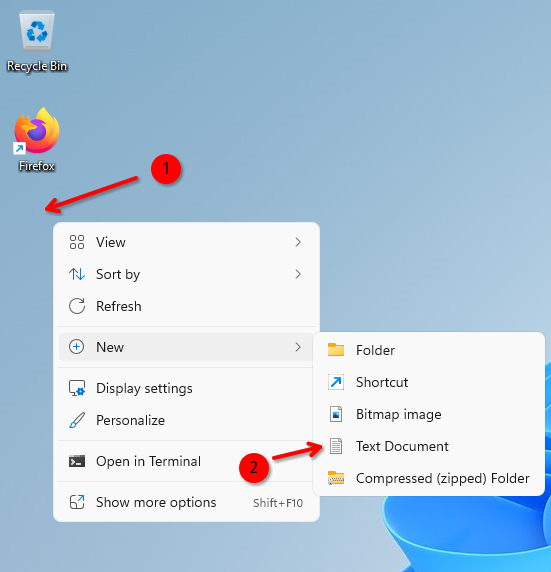

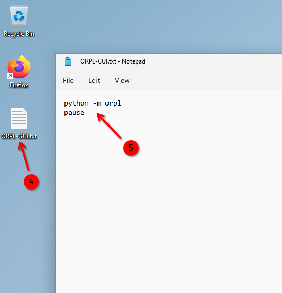

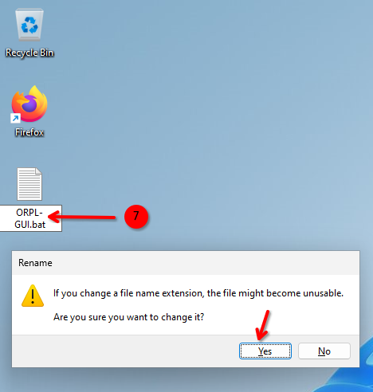
